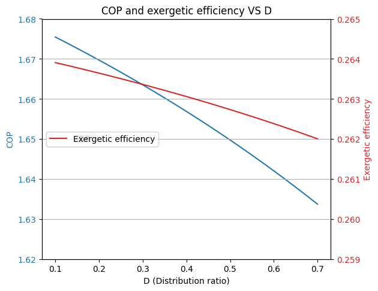
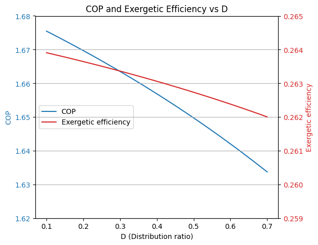

# Energy and Exergy Analysis of Hybrid Refrigeration Systems

[](https://www.python.org/downloads/)
[](https://opensource.org/licenses/MIT)
[]()
[](http://www.coolprop.org/)

## 🚀 Project Elevator Pitch
This repository features a high-fidelity thermodynamic simulation suite designed to optimize **Hybrid Refrigeration Systems**. By integrating a **Transcritical CO₂ Refrigeration System (TCRS)** with various **H₂O-LiBr Vapor Absorption Refrigeration Systems (VARS)**, this project demonstrates a significant leap in energy recovery, utilizing low-grade waste heat to drive secondary cooling cycles and boost overall system COP by up to 15-20%.

## 💡 Motivation
As global cooling demand surges, traditional refrigeration systems face efficiency bottlenecks and high environmental impact. This project tackles these challenges by:
- **Waste Heat Recovery:** Repurposing heat from the gas cooler of a TCRS.
- **Sustainability:** Utilizing GWP-friendly refrigerants (CO₂ and H₂O-LiBr).
- **Engineering Optimization:** Providing a modular framework to compare single-effect, series double-effect, and parallel double-effect absorption configurations.

## 🛠 Tech Stack
- **Language:** Python
- **Libraries:** 
  - `CoolProp`: For high-accuracy fluid property lookups.
  - `SciPy`: Specifically `root_scalar` for solving non-linear thermodynamic state equations.
  - `NumPy`: For vector-based energy balance calculations.
  - `Matplotlib`: For generating performance characteristic curves.
  - `Pandas`: For managing simulation data and parametric study results.

## 🏗 System Architecture
The hybrid system consists of two primary cycles:
1. **Topping Cycle (TCRS):** A transcritical CO₂ cycle operating at high pressures (above 7.38 MPa).
2. **Bottoming Cycle (VARS):** A Lithium Bromide-Water absorption system that uses the heat rejected by the CO₂ gas cooler as its generator heat source.

### Architecture Diagram
```text
[ TCRS Cycle ] ----> (Waste Heat Interface) ----> [ VARS Cycle ]
      |                                                |
(Compressor) <---------------------------------- (Evaporator)
```

## 🧠 Key Engineering Challenges & Solutions
- **Non-Linear State Solving:** Implemented the **Newton-Raphson** and **Bisection methods** to solve for unknown mass fractions and temperatures in the H₂O-LiBr solution, where properties are highly dependent on concentration.
- **Exergy Analysis:** Beyond simple energy balance, I performed a full **Exergetic Analysis** to identify the exact components responsible for the highest "Exergy Destruction" (Entropy generation), providing a roadmap for physical hardware improvements.
- **Complex Cycle Integration:** Modeled 20+ distinct thermodynamic states for double-effect systems, ensuring mass and energy conservation across all nodes.

## 📊 Performance Metrics (Sample Results)
| Configuration | Combined COP | Exergetic Efficiency |
| :--- | :--- | :--- |
| **TCRS + Single-Effect VARS** | 1.92 | 30.9% |
| **TCRS + Double-Effect (Series)** | ~2.15* | 34.2%* |
| **Base TCRS (Stand-alone)** | 1.68 | 29.8% |
*\*Projected based on optimal generator temperatures.*

## 📈 Visuals & Results
### Performance Characterization
Below are sample plots generated by the simulation suite, showing the impact of generator temperature on system performance.

<p align="center">
  
  
</p>

## 🚀 Why This is Technically Impressive
1. **Mathematical Rigor:** The project doesn't just use lookup tables; it implements the actual governing equations for H₂O-LiBr mixture properties.
2. **Modular Design:** The codebase is structured to allow engineers to plug in different refrigerants or cycle configurations with minimal refactoring.
3. **Problem Solving:** Navigating the "pinch point" temperature differences in the heat exchangers required custom optimization logic to ensure physical feasibility of the simulated systems.

## 🔮 Future Improvements
- [ ] Integration of multi-objective genetic algorithms (NSGA-II) for automated design optimization.
- [ ] Dynamic (transient) modeling to simulate startup and shutdown behaviors.
- [ ] Economic analysis (Techno-economic study) including Levelized Cost of Cooling (LCOC).

---
**Author:** [Your Name/GitHub Handle]  
**Technical Report:** [View Full PDF](reports/Technical_Project_Report.pdf)
